# ogpf
Object Based Interface to GnuPlot from Fortran (ogpf)

### GnuPlot Interface

	Purpose:   Object Based Interface to GnuPlot from Fortran (ogpf)
	Platform:  Windows XP/Vista/7/10, Linux
			   (It should work on other platforms, e.g Mac see the finalize_plot subroutine in ogpf.f90)
	Language:  Fortran 2003 and 2008
	Requires:  1. Fortran 2003 compiler (e.g gfortran 4.7, IVF 12.1, and later ...)
	              There is only two more features needs Fortran 2008 standard
                  execute_command_line and passing internal function as argument.
			   2. gnuplot 5 and higher (other previous version can be used)
    Author:    Mohammad Rahmani
               Chem Eng Dep., Amirkabir Uni. of Tech
               Tehran, Ir
               url:    aut.ac.ir/m.rahmani
               github: github.com/kookma
               email:  m[dot]rahmani[at]aut[dot]ac[dot]ir
    License:   MIT. Please always give a link to this repo

## PLotting Capabilities
### 2D Plots
* plot(v)
* plot(x,y)
* plot(x,y, linespec)
* plot(x1,y1,ls1, x2,y2,ls2, x3,y3,ls3, x4,y4,ls4)
* plot(x, M)
* semilogx(x,y)
* semilogy(x,y)
* loglog(x,y)
### 3D Plots
* surf(x,y,z)
* surf(x,y,z,lspec)
* surf(x,y,z, palette)
* surf(z, palette)
* contour(x,y,z,palette)
* contour(z,palette)
### Animation
* animation_start(delay)
* animation_show()

### Multiplot
* multiplot(rows, cols)

## Mathematical Utility Functions
* linspace(a,b,n)
* linspace(a,b)
* arange(a,b,dx)
* meshgrid(X,Y, xgv,ygv)


# Demo
There is a collection of examples in demo.f90 to show the capabilities of ogpf.

### Easy to use
To use ogpf in your project, add the library file to your fortran project (code)
* ogpf.f90 (the main library)
For details see 'demo.f90'

##### Important Note
To use ogpf on other operating system, you may need to modify the terminal type and fonts
in the section of **Configuration Parameters**.
A Makefile has been provided to build the demo from command line.

### Example codes
This section shows few example codes from **demo.f90**
* **Example 1**
```fortran
    SUBROUTINE Exmp01
        !...............................................................................
        !Example 1: A very basic example
        !...............................................................................
        TYPE(gpf):: gp
        INTEGER, PARAMETER:: n=17
        Real(wp):: x(n)
        Real(wp):: y(n)
        ! Input data
        x=dble([-8,-7,-6,-5,-4,-3,-2,-1,0,1,2,3,4,5,6,7,8])
        y=dble([66,51,38,27,18,11,6,3,2,3,6,11,18,27,38,51,66])

        ! Annotation: set title, xlabel, ylabel
        CALL gp%title('Example 1. A simple xy plot')
        CALL gp%xlabel('my x axis ...')
        CALL gp%ylabel('my y axis ...')
        Call gp%options('set style data linespoints')
        !Call Plot to draw a vector against a vector of data
        CALL gp%plot(x, y)
    END SUBROUTINE Exmp01
```

Will produce

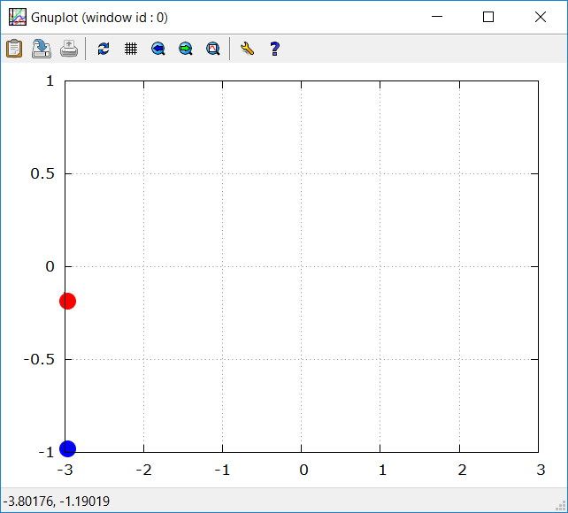

* **Example 05**
```fortran
    SUBROUTINE Exmp05
        !...............................................................................
        ! Example 5: Use line style and legends
        !...............................................................................
        TYPE(gpf):: gplot
        INTEGER, PARAMETER:: n=50
        Real(wp):: x(n)
        Real(wp):: ys(n)
        Real(wp):: yc(n)
        Real(wp):: ysc(n)
        Real(wp), PARAMETER :: pi=4.d0*atan(1.d0)
        ! Input data
        x=linspace(-2.d0*pi,2.d0*pi,n)  !linspace is a utility function from module Utils
        ys=sin(x)
        yc=exp(-0.1d0*x)*cos(x)
        ysc=sin(x/2.d0)*cos(2.d0*x)

        ! Annotation, set title, xlabel, ylabel
        CALL gplot%title('Example 5. A sample with style and legends')
        CALL gplot%xlabel('x, rad')
        CALL gplot%ylabel('y, dimensionless')

        ! Plot to draw three set of data
        CALL gplot%plot(x,ys,'title "sin" with lines lt 5 lc rgb "#0008B0"', &
                        x,yc,'title "cos" with points lt 6 lc rgb "#FF1100"', &
                        x,ysc,'title "sin(x/2)cos(2x)" with lp lt 7 lc rgb "#00AA04"' )

    END SUBROUTINE Exmp05
```
Will produce


* **Example 06**

```fortran
  SUBROUTINE Exmp06
        !...............................................................................
        ! Example 6: Plot a single point along with a series of data
        !...............................................................................
        TYPE(gpf):: gplot
        INTEGER, PARAMETER:: n=125

        Real(wp):: x(n)
        Real(wp):: y(n)

        Real(wp), PARAMETER :: pi=4.d0*atan(1.d0)
        ! Input data
        x=linspace(0.d0,pi*2.d0,n)  !linspace is a utility function from module Utils
        y=sin(6.d0*x)*exp(-x)


        ! Annotation, set title, xlabel, ylabel
        CALL gplot%title('Example 6. A sample shows sin(x) and its zero on the plot')
        CALL gplot%xlabel('x, rad')
        CALL gplot%ylabel('sin(x), dimensionless')
        Call gplot%options('set grid')

        ! Plot to draw two set of data, a series and a single point
        CALL gplot%plot(x,y,'title "sin(x)" with lines lt 3', &
                        [pi],[0.d0],'title "zero" with points pt 7 ps 2 lc rgb "#FF0000"')
    END SUBROUTINE Exmp06
```

Will produce

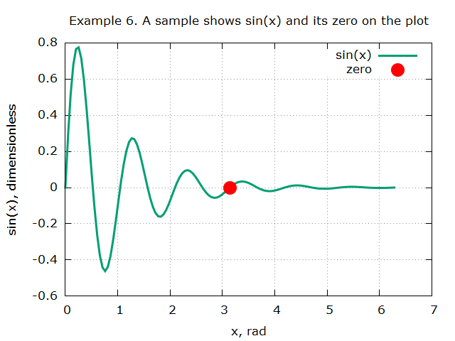


* **Example 08**

```fortran
    SUBROUTINE Exmp08
    !...............................................................................
    !Plot a matrix against a vector
    !...............................................................................
        TYPE(gpf):: MatPlot
        INTEGER, PARAMETER:: n=25
        Real(wp):: tf
        Real(wp):: vo
        Real(wp):: g
        Real(wp):: t(n)
        Real(wp):: y(n,6)

        !Create data
        tf=10.d0
        g=32.d0;
        t=linspace(0.d0,tf,n)
        vo=150.d0;
        y(:,1)=vo*t-0.5d0*g*t**2
        vo=125.d0;
        y(:,2)=vo*t-0.5d0*g*t**2
        vo=100.d0;
        y(:,3)=vo*t-0.5d0*g*t**2
        vo=75.d0;
        y(:,4)=vo*t-0.5d0*g*t**2
        vo=50.d0;
        y(:,5)=vo*t-0.5d0*g*t**2
        vo=25.d0;
        y(:,6)=vo*t-0.5d0*g*t**2

        !Draw the matrix y againest vector x
        CALL MatPlot%title('Example 8. Plotting a Matrix against a vector')
        CALL MatPlot%xlabel ('t, sec')
        CALL MatPlot%ylabel ('y, feet')
        call MatPlot%Options('set xrange[0:10];set yrange [0:400];')
        CALL MatPlot%plot(t, y)

        !Another Matrix plot with legends [line specification]
        CALL MatPlot%title('Example 8.2: Using legends when plotting a matrix against a vector')
        Call MatPlot%plot(t, y(:,1:2), lspec=["t 'vo=150'", "t 'vo=125'"])
    END SUBROUTINE Exmp08
```
Will produce


* **Example 11**

```fortran
!...............................................................................
! Example 11: A simple polar plot
!...............................................................................
    SUBROUTINE Exmp11
        TYPE(gpf):: gp
        INTEGER, PARAMETER :: n=75
        Real(wp):: t(n)
        Real(wp):: r(n)
        Real(wp):: pi=4.d0*atan(1.d0)
    !1. reset gplot
     CALL gp%reset()

    !2. set option, and set plot as polar
        call gp%options("&
            &set polar;&
            &set trange [-pi/2:pi/2]")

    ! 3. create data
        t=linspace(-pi/2.d0,pi/2.d0,n)
        r=sin(3.d0*t)

    !Annotation, set title, xlabel, ylabel
    CALL gp%title("Example 11: simple polar plot")
    CALL gp%xlabel("x,...")
    CALL gp%ylabel("y,...")

    !Call plot method
    CALL gp%plot(t,r)

    END SUBROUTINE Exmp11
```
Will produce

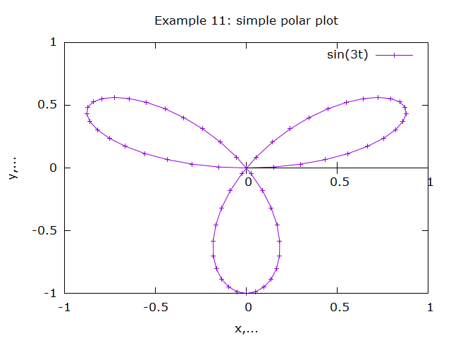


* **Example 18**

```fortran
   SUBROUTINE Exmp18()
        !Use gnuplot script
        !to send a special script file to gnuplot
        !the file is an external file here is called "simple.plt"
        TYPE(gpf):: gp
        CALL gp%title("Example 18. Running an external script file")
        CALL gp%script("load 'simple.plt'")

    END SUBROUTINE Exmp18
```
Will produce


* **Example 21**

```fortran
   SUBROUTINE Exmp21()
         !Another simple 3d plot
        TYPE(gpf):: gp
        Real(wp), ALLOCATABLE:: X(:,:)
        Real(wp), ALLOCATABLE:: Y(:,:)
        Real(wp), ALLOCATABLE:: Z(:,:)
        INTEGER:: m
        INTEGER:: n
        CALL meshgrid(X, Y, [Real(wp)::-15.,15.,0.75] )
        m=size(X,1)
        n=size(X,2)
        ALLOCATE( Z(m,n) )
        Z=sin(sqrt(x**2+y**2))/sqrt(x**2+y**2+0.025)

        CALL gp%title('Example 21: Simple 3D plot using splot')
        CALL gp%xlabel('x-axis,...')
        CALL gp%ylabel('y-axis,...')
        CALL gp%zlabel('z-axis,...')

        !plot the 3D data
        CALL gp%surf(Z)

    END SUBROUTINE Exmp21
```
Will produce


## 3D plots: surf and contour

* **Example 101**

Using different color palettes

```fortran
    subroutine exmp101

        type(gpf):: gp
        real(wp), allocatable:: x(:,:)
        real(wp), allocatable:: y(:,:)
        real(wp), allocatable:: z(:,:)
        real(wp):: a=0.5d0
        real(wp):: b=2.0d0
        real(wp), allocatable :: xgrid(:)
        real(wp), allocatable :: ygrid(:)
        integer:: m
        integer:: n

        ! create 3D data
        m=55 ! number of grid points in y direction
        n=25 ! number of grid points in x direction
        xgrid=linspace(-10.0_wp, 10.0_wp, m)
        ygrid=linspace(0.0_wp, 5.0_wp, n)
        allocate( z(m,n) )

        call meshgrid(x, y, xgrid, ygrid) ! generate the 2D grid data
        z=(x**2/a - y**2/b)

        ! annotation
        call gp%title('Example 101: Simple 3D plot')
        call gp%xlabel('x-axis,...')
        call gp%ylabel('y-axis,...')
        call gp%zlabel('z-axis,...')

        !plot the 3D data
        call gp%surf(x, y, z, lspec='t "default color spec"' ) ! color palette: gnuplot default
        call gp%surf(x, y, z, lspec='t "Ann Schnider set1"', palette='set1' ) ! color palette: set1
        call gp%surf(x, y, z, lspec='t "Matlab Jet"', palette='jet' ) ! color palette: Matlab jet
    end subroutine exmp101

```
Will produce

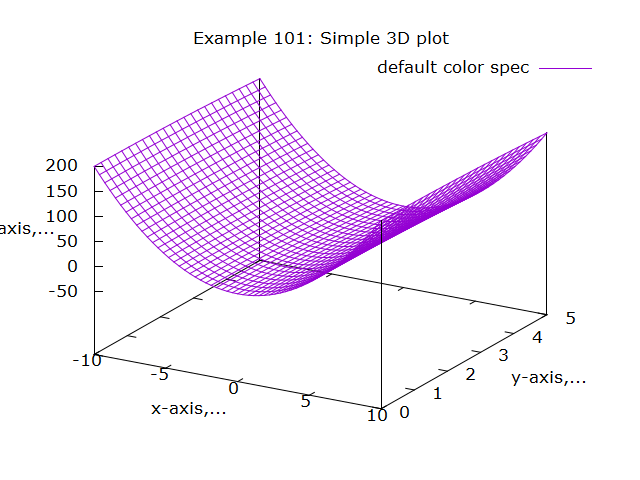
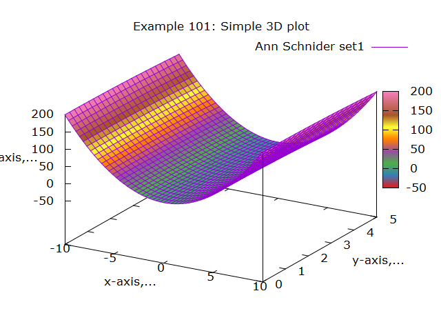
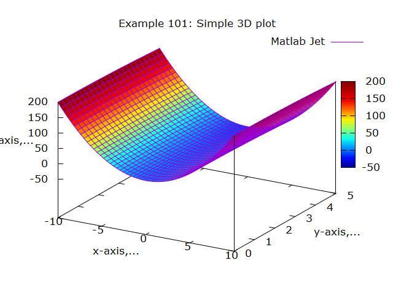


* **Example 102**

Simple surface plot with color palette


```fortran
   subroutine exmp102()
        type(gpf):: gp

        real(wp), parameter :: pi=4.0_wp*atan(1.0_wp)

        real(wp), allocatable:: x(:,:)
        real(wp), allocatable:: y(:,:)
        real(wp), allocatable:: z(:,:)
        integer:: m
        integer:: n

        ! generate data
        call meshgrid(x, y, linspace(-0.75_wp*pi, 0.75_wp*pi, 35) ) ! xgrid == ygrid
        m=size(x,1)
        n=size(x,2)
        allocate( z(m,n) )

        !z= sin(x) * cos (y)
        where (x**2 + y**2 == 0.0_wp)
            z=1.0_wp
        elsewhere
            z=sin(x**2+y**2)/(x**2+y**2)
        end where


        call gp%title('Example 102: Simple 3D plot with color palette')
        call gp%xlabel('x-axis,...')
        call gp%ylabel('y-axis,...')
        call gp%options('set style data lines')

        !plot the 3D data
        CALL gp%surf(X,Y,Z, palette='jet')

    end subroutine exmp102
```
Will produce

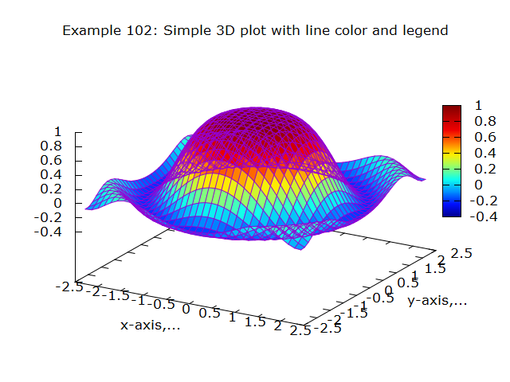


* **Example 103**

A beautiful surface plot

```fortran
    subroutine exmp103()

        type(gpf):: gp
        real(wp), allocatable:: x(:,:)
        real(wp), allocatable:: y(:,:)
        real(wp), allocatable:: z(:,:)
        real(wp):: a=-0.5_wp
        real(wp):: b= 0.5_wp
        real(wp):: pi= 4.0_wp * atan(1.0_wp)
        integer:: m
        integer:: n

        ! create 3D data
        call meshgrid( x, y, linspace(a, b, 55) )
        m=size(x,1)
        n=size(x,2)
        allocate( z(m,n) )
        z= cos(2.0*pi*x) * sin(2.0*pi*y)


        ! annotation
        call gp%title('Example 103: A beautiful surface plot with hidden details')
        call gp%options('set hidden3d')
        call gp%options('unset key')

        !plot the 3D data
        call gp%surf(x, y, z, palette='jet' ) ! color palette: Matlab jet
        ! contour
        call gp%contour(x,y,z, palette='set1')

    end subroutine exmp103
```
Will produce

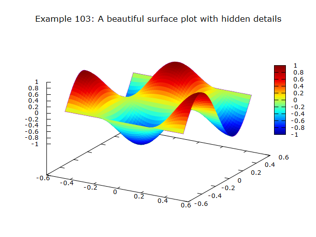


* **Example 104**

Cylindrical mapping


```fortran
    subroutine exmp104()
        type(gpf):: gp
        integer, parameter :: m = 35
        integer, parameter :: n = 15
        real(wp)           :: xv(m), yv(n)
        real(wp), dimension(:,:), allocatable:: x,y,z
        real(wp):: pi= 4.0_wp * atan(1.0_wp)

        xv = linspace(0.0_wp, pi, m)
        yv = linspace(0.0_wp, pi, n)
        call meshgrid(x,y, xv, yv)
        allocate( z(size(x,dim=1), size(x, dim=2)) )
        z = sin(y)


        ! advanced options
        call gp%options('set mapping cylindrical')
        call gp%options('unset tics')
        call gp%options('unset border')
        call gp%options('set view 147,312')
        call gp%options('set hidden3d')

        !
        call gp%title('Example 104. Cylindrical Mapping')
        call gp%surf(x,y,z)

    end subroutine exmp104
```
Will produce

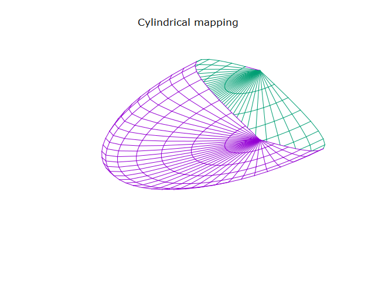


* **Example 105**

Contour plot and surface plot


```fortran

    subroutine exmp105()
        
        type(gpf):: gp

        real(wp), allocatable:: x(:,:)
        real(wp), allocatable:: y(:,:)
        real(wp), allocatable:: z(:,:)
        integer:: m
        integer:: n
        real(wp), parameter :: pi=4.0_wp*atan(1.0_wp)

        ! create the xyz data
        call meshgrid(x, y, linspace(-2.0_wp,2.0_wp, 65), linspace(-2.0_wp,3.0_wp, 65)  )

        m=size(x,1)
        n=size(x,2)
        allocate( z(m,n) )

        z = x * exp(-x**2 - y**2)

        call gp%options('unset key')
        call gp%options('unset surface')
        call gp%axis([real(wp):: -2, 2, -2, 3])

        !plot the contour
        call gp%title('Example 105: Contour plot')
        call gp%options('unset border; unset tics')
        call gp%surf(x,y,z, palette='accent')
        call gp%contour(x,y,z, palette='jet')

    end subroutine exmp105

```
Will produce

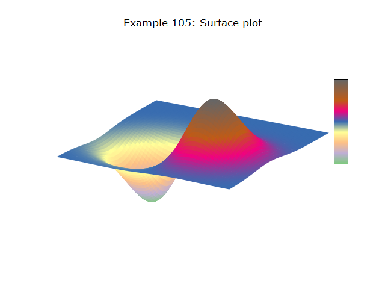


* **Example 106**

Animation with 3D plots


```fortran
   subroutine exmp106()

        type(gpf):: gp
        integer,  parameter :: n=25, m=55
        real(wp) :: xv(m), yv(n), t
        real(wp), allocatable :: x(:,:), y(:,:), z(:,:)
        real(wp), parameter :: pi=4.0_wp*atan(1.0_wp)

        ! generate data
        xv = linspace(0.0_wp, 2.0_wp*pi, m)
        yv = linspace(0.0_wp, 2.0_wp*pi, n)
        call meshgrid(x, y, xv, yv)
        z = sin(x) + cos(y)

        call gp%title('Example 106. Animation of surface plot')
        call gp%axis([0.0_wp, 2.0*pi, 0.0_wp, 2.0*pi])
        call gp%options('unset colorbox')
        call gp%options('set ticslevel 0')
        call gp%axis([0.0_wp, 2.0*pi, 0.0_wp, 2.0*pi, -2.0_wp, 2.0_wp])

        call gp%animation_start(1)
        t=0.050_wp
        do
            ! add frames
            call gp%surf(x, y, sin(t*pi/2.0)*z, palette='jet')
            t=t+0.1_wp
            if (t > 1.0_wp) exit
        end do
        ! show frames in ornithological order with a pause set in
        ! animation_start
        call gp%animation_show()

    end subroutine exmp106

```
Will produce

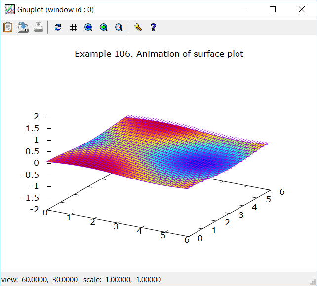


* **Example 107**

Multiplot layout for 3D plots

```fortran
  subroutine exmp107()
        !...............................................................................
        !Example 107: Multiplot layout in 3D and Contour plot
        !...............................................................................
        type(gpf):: gp

        real(wp), allocatable:: x(:,:)
        real(wp), allocatable:: y(:,:)
        real(wp), allocatable:: z1(:,:)
        real(wp), allocatable:: z2(:,:)
        integer:: m
        integer:: n
        real(wp), parameter :: pi=4.0_wp*atan(1.0_wp)

        ! create the xyz data
        call meshgrid(x, y, linspace(-pi,pi, 60)  )

        m=size(x,1)
        n=size(x,2)
        allocate( z1(m,n) )
        allocate( z2(m,n) )

        z1 = sin(x) + cos(y)
        z2 = sin(x) * cos(y)

        call gp%options('unset key')
        call gp%axis([-pi,pi,-pi,pi])
        call gp%options('unset colorbox')
        call gp%options('set autoscale fix')
        call gp%options('unset tics')

        !plot the contour
        call gp%title('Example 105: Contour plot')
        call gp%multiplot(1,2)
        call gp%surf(x,y,z1)
        call gp%surf(x,y,z2)

        call gp%multiplot(2,1)
        call gp%options('set colorbox')
        call gp%options('set tics')
        call gp%contour(x,y,z1, palette='jet')
        call gp%contour(x,y,z2, palette='set1')


    end subroutine exmp107
```
Will produce


