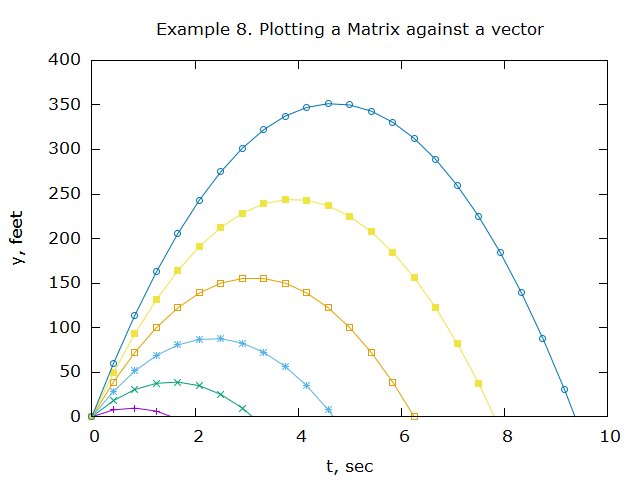
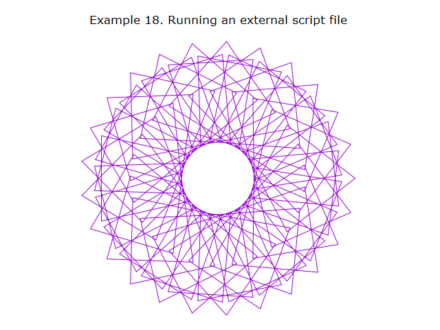

## ogpf
Object Based Interface to GnuPlot from Fortran (ogpf)

### GnuPlot Interface

	Purpose:   Object Based Interface to GnuPlot from Fortran (ogpf)
	Platform:  Windows XP/Vista/7/10, Linux
			   (It should work on other platforms, e.g Mac see the Write2GnuPlot subroutine in ogpf.f90)
	Language:  Fortran 2003 and 2008
	Requires:  1. Fortran 2003 compiler (e.g gfortran 4.7, IVF 12.1, and later ...)
			       2. gnuplot 4.5 and higher (other previous version can be used
	Author:    Mohammad Rahmani
			       Chem Eng Dep., Amirkabir Uni. of Tech

### Procedures
**plot**

* plot a single vector v
* plot a vector y against vector x
* plot up to four pairs of x-y set at the same time
* plot a matrix Y versus a vector x

**surf**

* surface plot
* mesh plot
* contour plot

**script**
* use a customised script to plot data from inside a fortran code
 
**meshgrid**
* generate mesh grid over a rectangular domain of [xmin xmax, ymin, max]
 
**linspace**
* returns a linearly spaced vector with n points in [a, b]

### Demo
There is a collection of examples in demo.f90 to show the capabilities of ogpf.

### Easy to use
To use ogpf in your project, add these to files to your fortran project (code)
* ogpf.f90 (the main library)
* select_precision.f90 (to choose the working precision)
For details see 'demo.f90'

### Example codes
This section shows few example codes from **demo.f90**
* **Example 1**
```fortran
    SUBROUTINE Exmp01
        !...............................................................................
        !Example 1: A very basic example
        !...............................................................................
        TYPE(gpf):: gp
        INTEGER, PARAMETER:: n=17
        Real(wp):: x(n)
        Real(wp):: y(n)
        ! Input data
        x=dble([-8,-7,-6,-5,-4,-3,-2,-1,0,1,2,3,4,5,6,7,8])
        y=dble([66,51,38,27,18,11,6,3,2,3,6,11,18,27,38,51,66])

        ! Annotation: set title, xlabel, ylabel
        CALL gp%title('Example 1. A simple xy plot')
        CALL gp%xlabel('my x axis ...')
        CALL gp%ylabel('my y axis ...')
        Call gp%options('set style data linespoints')
        !Call Plot to draw a vector against a vector of data
        CALL gp%plot(x, y)
    END SUBROUTINE Exmp01
```

Will produce


* **Example 05**
```fortran
    SUBROUTINE Exmp05
        !...............................................................................
        ! Example 5: Use line style and legends
        !...............................................................................
        TYPE(gpf):: gplot
        INTEGER, PARAMETER:: n=50
        Real(wp):: x(n)
        Real(wp):: ys(n)
        Real(wp):: yc(n)
        Real(wp):: ysc(n)
        Real(wp), PARAMETER :: pi=4.d0*atan(1.d0)
        ! Input data
        x=linspace(-2.d0*pi,2.d0*pi,n)  !linspace is a utility function from module Utils
        ys=sin(x)
        yc=exp(-0.1d0*x)*cos(x)
        ysc=sin(x/2.d0)*cos(2.d0*x)

        ! Annotation, set title, xlabel, ylabel
        CALL gplot%title('Example 5. A sample with style and legends')
        CALL gplot%xlabel('x, rad')
        CALL gplot%ylabel('y, dimensionless')

        ! Plot to draw three set of data
        CALL gplot%plot(x,ys,'title "sin" with lines lt 5 lc rgb "#0008B0"', &
                        x,yc,'title "cos" with points lt 6 lc rgb "#FF1100"', &
                        x,ysc,'title "sin(x/2)cos(2x)" with lp lt 7 lc rgb "#00AA04"' )

    END SUBROUTINE Exmp05
```
Will produce


* **Example 06**
```fortran
  SUBROUTINE Exmp06
        !...............................................................................
        ! Example 6: Plot a single point along with a series of data
        !...............................................................................
        TYPE(gpf):: gplot
        INTEGER, PARAMETER:: n=125

        Real(wp):: x(n)
        Real(wp):: y(n)

        Real(wp), PARAMETER :: pi=4.d0*atan(1.d0)
        ! Input data
        x=linspace(0.d0,pi*2.d0,n)  !linspace is a utility function from module Utils
        y=sin(6.d0*x)*exp(-x)


        ! Annotation, set title, xlabel, ylabel
        CALL gplot%title('Example 6. A sample shows sin(x) and its zero on the plot')
        CALL gplot%xlabel('x, rad')
        CALL gplot%ylabel('sin(x), dimensionless')
        Call gplot%options('set grid')

        ! Plot to draw two set of data, a series and a single point
        CALL gplot%plot(x,y,'title "sin(x)" with lines lt 3', &
                        [pi],[0.d0],'title "zero" with points pt 7 ps 2 lc rgb "#FF0000"')
    END SUBROUTINE Exmp06

```
Will produce


* **Example 08**
```fortran
    SUBROUTINE Exmp08
    !...............................................................................
    !Plot a matrix against a vector
    !...............................................................................
        TYPE(gpf):: MatPlot
        INTEGER, PARAMETER:: n=25
        Real(wp):: tf
        Real(wp):: vo
        Real(wp):: g
        Real(wp):: t(n)
        Real(wp):: y(n,6)

        !Create data
        tf=10.d0
        g=32.d0;
        t=linspace(0.d0,tf,n)
        vo=150.d0;
        y(:,1)=vo*t-0.5d0*g*t**2
        vo=125.d0;
        y(:,2)=vo*t-0.5d0*g*t**2
        vo=100.d0;
        y(:,3)=vo*t-0.5d0*g*t**2
        vo=75.d0;
        y(:,4)=vo*t-0.5d0*g*t**2
        vo=50.d0;
        y(:,5)=vo*t-0.5d0*g*t**2
        vo=25.d0;
        y(:,6)=vo*t-0.5d0*g*t**2

        !Draw the matrix y againest vector x
        CALL MatPlot%title('Example 8. Plotting a Matrix against a vector')
        CALL MatPlot%xlabel ('t, sec')
        CALL MatPlot%ylabel ('y, feet')
        call MatPlot%Options('set xrange[0:10];set yrange [0:400];')
        CALL MatPlot%plot(t, y)

        !Another Matrix plot with legends [line specification]
        CALL MatPlot%title('Example 8.2: Using legends when plotting a matrix against a vector')
        Call MatPlot%plot(t, y(:,1:2), lspec=["t 'vo=150'", "t 'vo=125'"])
    END SUBROUTINE Exmp08

```
Will produce




* **Example 11**
```fortran
!...............................................................................
! Example 11: A simple polar plot
!...............................................................................
    SUBROUTINE Exmp11
        TYPE(gpf):: gp
        INTEGER, PARAMETER :: n=75
        Real(wp):: t(n)
        Real(wp):: r(n)
        Real(wp):: pi=4.d0*atan(1.d0)
    !1. reset gplot
     CALL gp%reset()

    !2. set option, and set plot as polar
        call gp%options("&
            &set polar;&
            &set trange [-pi/2:pi/2]")

    ! 3. create data
        t=linspace(-pi/2.d0,pi/2.d0,n)
        r=sin(3.d0*t)

    !Annotation, set title, xlabel, ylabel
    CALL gp%title("Example 11: simple polar plot")
    CALL gp%xlabel("x,...")
    CALL gp%ylabel("y,...")

    !Call plot method
    CALL gp%plot(t,r)

    END SUBROUTINE Exmp11

```
Will produce


* **Example 18**
```fortran
   SUBROUTINE Exmp18()
        !Use gnuplot script
        !to send a special script file to gnuplot
        !the file is an external file here is called "simple.plt"
        TYPE(gpf):: gp
        CALL gp%title("Example 18. Running an external script file")
        CALL gp%script("load 'simple.plt'")

    END SUBROUTINE Exmp18

```
Will produce



* **Example 21**
```fortran
   SUBROUTINE Exmp21()
         !Another simple 3d plot
        TYPE(gpf):: gp
        Real(wp), ALLOCATABLE:: X(:,:)
        Real(wp), ALLOCATABLE:: Y(:,:)
        Real(wp), ALLOCATABLE:: Z(:,:)
        INTEGER:: m
        INTEGER:: n
        CALL meshgrid(X, Y, [Real(wp)::-15.,15.,0.75] )
        m=size(X,1)
        n=size(X,2)
        ALLOCATE( Z(m,n) )
        !Z=X*X*exp(-X*X) * Y*Y*exp(-Y*Y)
        !Z=x*y**3-y*x**3
        ! Z=-1/(X**2+Y**2+0.25)
        Z=sin(sqrt(x**2+y**2))/sqrt(x**2+y**2+0.025)

        CALL gp%title('Example 21: Simple 3D plot using splot')
        CALL gp%xlabel('x-axis,...')
        CALL gp%ylabel('y-axis,...')
        CALL gp%zlabel('z-axis,...')

        !plot the 3D data
        !CALL gp%surf(X,Y,Z,lspec= 'title "Sample 3D plot"')
        CALL gp%surf(Z) !,lspec= 'title "Sample 3D plot"')

    END SUBROUTINE Exmp21
```
Will produce


